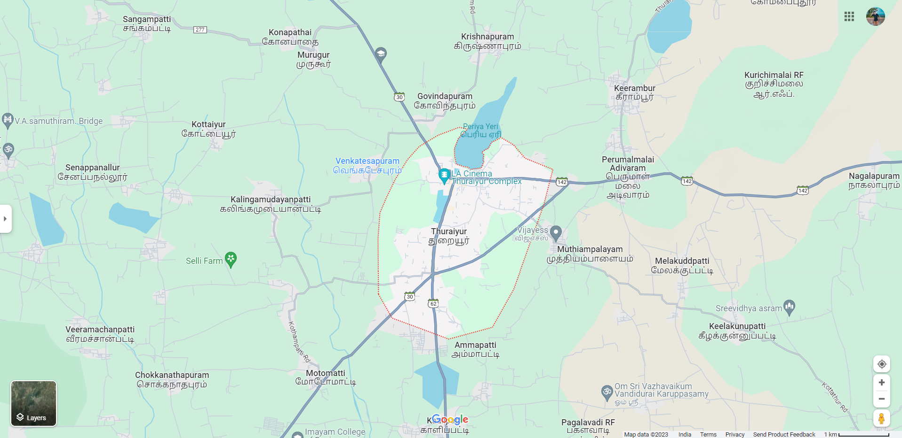

# Ex04 Places Around Me
## Date: 22-11-2023

## AIM
To develop a website to display details about the places around my house.

## DESIGN STEPS

### STEP 1
Create a Django admin interface.

### STEP 2
Download your city map from Google.

### STEP 3
Using ```<map>``` tag name the map.

### STEP 4
Create clickable regions in the image using ```<area>``` tag.

### STEP 5
Write HTML programs for all the regions identified.

### STEP 6
Execute the programs and publish them.

## CODE
```
map.html

<html>
<head>
<title>My City</title>
<style type="text/css">
    img {
      width:100%;
      height:100%;
      
    }
    </style>    
</head>
<body>

<center>

<map name="MyCity">
<area shape="rect" coords="690,620,870,220" href="thuraiyur.html" title="thuraiyur">
<area shape="rect" coords="1000,150,1359,46" href="keerambur.html" title="keerambur">
<area shape="rect" coords="1350,250,1500,400" href="nagalapuram.html" title="nagalapuram">
<area shape="rect" coords="265,1900,485,300" href="chokkanatgapuram.html" title="chokkanatgapuram">
<area shape="rect" coords="500,21,755,171" href="murugur.html" title="murugur">
</map>
</center>
</body>
</html>

thuraiyur.html

<html>
    <head>
        <title>MY HOME TOWN</title>
    </head>
    <body bgcolor="yellow">
        <h1 align="center">
            <font color="red"><b>Thuraiyur</b></font>
        </h1>
        <h3 align="center">
            <font color="blue"><b>Thuraiyur - My Home Town</b></font>
        </h3>
        <hr size="3" color="red">
        <p align="justify">
            <font face="Georgia" sixe="5">
                Thuraiyur is a town and a municipality in the Tiruchirappalli district in the Indian state of Tamil Nadu.
                 It was upgraded to a III Grade Municipality from Town Panchayat on 17 January 1970, and to a II Grade Municipality in May 1998.
                  It was upgraded to Selection Grade Municipality in the year 2008.
                 It is also a taluka (administrative centre).
                  It is located 310 km away from Chennai


            </font>
        </p>
        </body>
        </html>

        keerambur.html

        <html>
    <head>
        <title>keerambur</title>
    </head>
    <body bgcolor="cyan">
        <h1 align="center">
            <font color="fushsia"><b>keerambur</b></font>
        </h1>
        <h3 align="center">
            <font color="blue"><b>Keerambur - Neighbouring village</b></font>
        </h3>
        <hr size="3" color="red">
        <p align="justify">
            <font face="Georgia" sixe="5">
                According to Census 2011 information the location code or village code of Keerambur village is 635783.
                 Keerambur village is located in Thuraiyur taluka of Tiruchirappalli district in Tamil Nadu, India. 
                It is situated 3km away from sub-district headquarter Thuraiyur (tehsildar office) and 48km away from district headquarter Tiruchirappalli. 
                As per 2009 stats, Keerambur village is also a gram panchayat.


                
        </p>
        </body>
        </html>

        chokkanatgapuram.html

        <html>
    <head>
        <title>chokkanatgapuram</title>
    </head>
    <body bgcolor="green">
        <h1 align="center">
            <font color="aqua"><b>chokkanatgapura</b></font>
        </h1>
        <h3 align="center">
            <font color="blue"><b>chokkanatgapuram- Neighbouring village<</b></font>
        </h3>
        <hr size="3" color="black">
        <p align="justify">
            <font face="Georgia" sixe="5">
                It is a small village near thuraiyur. it is a small vilage with less than 1000 peoples.
                according to the poll on the total population in the village is 989.As per 2009 stats,  chokkanatgapuram village is also a gram panchayat.

                

                
        </p>
        </body>
        </html>

        nagalapuram.html

        <html>
    <head>
        <title>MY HOME TOWN</title>
    </head>
    <body bgcolor="yellow">
        <h1 align="center">
            <font color="teal"><b>nagalapuram</b></font>
        </h1>
        <h3 align="center">
            <font color="blue"><b>nagalapuram- Neighbouring village<</b></font>
        </h3>
        <hr size="3" color="pink">
        <p align="justify">
            <font face="Georgia" sixe="5">It is a small village near thuraiyur.
                 it is a small vilage with less than 5000 peoples.
                according to the poll on the total population in the village is 4989.
                As per 2009 stats,  nagalapuram village is also a gram panchayat.

                
                

            </font>
        </p>
        </body>
        </html>

        murugur.html

        <html>
    <head>
        <title>MURUGUR</title>
    </head>
    <body bgcolor="olive">
        <h1 align="center">
            <font color="red"><b>murugur</b></font>
        </h1>
        <h3 align="center">
            <font color="blue"><b>murugur- Neighbouring village<</b></font>
        </h3>
        <hr size="3" color="black">
        <p align="justify">
            <font face="Georgia" sixe="5"> According to Census 2011 information the location code or village code of Murugur village is 635784.
                 Murugur village is located in Thuraiyur taluka of Tiruchirappalli district in Tamil Nadu, India.
                 It is situated 5km away from sub-district headquarter Thuraiyur (tehsildar office) and 50km away from district headquarter Tiruchirappalli.
                 As per 2009 stats, Murugur village is also a gram panchayat.
                

            </font>
        </p>
        </body>
        </html>

```


## OUTPUT


## RESULT
The program for implementing image maps using HTML is executed successfully.
